# Loom for iOS

原生 SwiftUI 多模型并行对话工作台，支持 **iPhone 和 iPad**。使用系统原生 Liquid Glass，最低需要 **iOS / iPadOS 26**。

## 两种阅读方式

- **iPhone**：单列回答，顶部玻璃模型标签；点击标签或左右滑动切换，顶部只保留标签与更多菜单。底部输入框随键盘抬升，支持换行，发送按钮位于输入框内部右下角。
- **iPad**：宽窗口并排阅读模型回答，各列独立滚动；列数多时支持横向滚动。窗口宽度小于 700 pt 时自动使用单列标签布局。
- **文本高亮**：长按选择文字后，点击系统菜单中的“高亮”，加入下一轮引用。默认单击一句快捷高亮；相邻高亮自动合成一个引用，再次点击其中任一句取消整块；设置中可改为双击。按句号、问号和感叹号等句末标点划分，也按逗号、冒号和分号分割，顿号不分割。拖动选区手柄到阅读区域边缘可自动滚动。删除引用标签会同步取消对应原文高亮，恢复 Markdown 样式。扩大选区会替换重叠引用，避免重复。
- **SVG 图像**：回答中的完整 SVG 标签及 SVG/XML/HTML 代码块会直接显示矢量图像，自适应阅读列宽。SVG 周围文字继续保留原生选区和高亮。
- **引用追问**：所有模型收到相同的问题和带来源、型号、轮次的高亮引用；各自保留独立对话上下文。
- **1–5 个模型**：支持 OpenAI 兼容接口与 Anthropic，内置 OpenAI、Claude、Gemini、DeepSeek、千问、Kimi、GLM、Grok 厂商预设；自动填写接口，输入 Key 后自动获取在线型号，支持手动型号输入。
- **历史对话**：本地保存对话、草稿、引用和高亮，支持搜索、轮次跳转和分享回答。阅读时右侧浮现轮次横杠，支持点击跳转和按住拖动切换。使用系统红色左滑删除操作，完整左滑可直接触发系统“取消 / 删除”确认弹框。
- **备份**：右上角「…」→「备份（导入 / 导出）」，通过系统文件窗口保存至本机或 iCloud 云盘，也可从任一位置导入。包含对话、高亮、引用、草稿、模型配置及偏好；API Key 默认不导出，可单独勾选。导入前检查格式，并保留原有本地记录。
- **请求控制**：并行请求、停止生成、单列失败重试；切换对话会先取消当前请求。

## 预览

截图使用 `--demo` 启动参数，回答为本地示例，不会调用真实模型。

| iPhone | iPad |
| --- | --- |
| 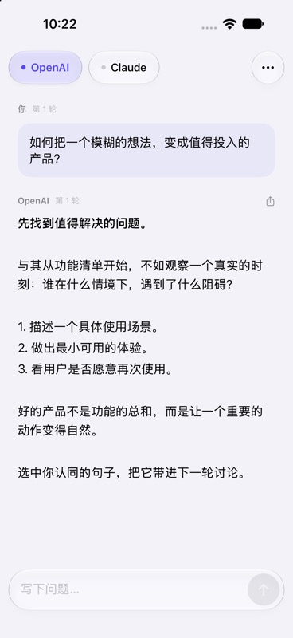 | 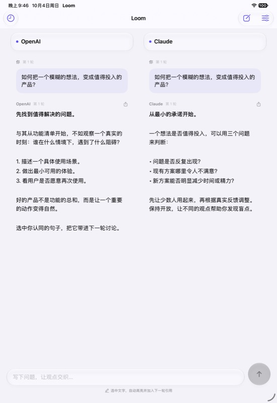 |

## 在 Xcode 中运行

1. 用 **Xcode 26 或更高版本** 打开 `Loom.xcodeproj`。
2. 选择 `Loom` scheme 和 iPhone / iPad 模拟器，运行。
3. 点右上角「…」→ 模型设置，选择预设厂商，接口自动填写；输入 API Key 后自动获取在线型号，选择后保存。
4. 同时向所有配置模型发送问题；只需要一个模型时，可以在设置中移除另一个。

真机运行时，在 `Signing & Capabilities` 中选择自己的开发团队。仓库不包含签名证书、描述文件或开发团队 ID。

项目配置由 `project.yml` 管理；修改目标或构建设置后可重新生成：

```sh
brew install xcodegen
xcodegen generate
```

项目没有第三方运行时依赖。默认界面为中文，支持系统深色模式、动态字体和 VoiceOver。原生玻璃效果由 `glassEffect`、`GlassEffectContainer`、玻璃按钮样式和系统工具栏提供。

## 后端与数据

默认**直接连接模型服务商**，不依赖 Loom 后端。在设置中开启「使用转发服务」后，可复用网页后端。预填转发服务：`https://relay.minidesk.online:8443/loom`，兼容网页 Loom 的 `/api/chat` 与 `/api/models`。可在设置中更换 HTTPS 转发服务。

- API Key 保存在系统钥匙串（`WhenUnlockedThisDeviceOnly`），不写入日常对话 JSON，不提交到仓库。只有勾选「同时备份 API Key」时，导出的备份 JSON 才会包含密钥；该文件请保存到可信位置。
- 直连模式仅向配置的服务商发送 API Key、对话上下文和高亮引用；转发模式还会经过所配置的转发服务。请使用可信任的转发服务，并查看对应提供商的数据政策。
- 对话存于 App 沙盒的 `Application Support/Loom/state.json`，使用原子写入和系统文件保护。
- 本地记录损坏时保留原文件并显示提示，不覆盖原记录。
- 支持手动导入 / 导出备份以迁移 iOS 设备；本版本不提供账号、自动跨设备同步或网页历史迁移。
- 本版本使用完整响应接口，回答完成后显示；暂不支持流式输出。
- 后台运行并无完成保证。应用被结束后，再次打开会将未完成请求标为可重试。

删除 App 会删除本地对话；钥匙串凭据可能被系统保留。正式发布前需要准备隐私政策、App Store 隐私披露、签名和真实服务商联调。

## 验证

本地使用 Xcode 27 / iOS 27 模拟器验证，部署目标仍为 iOS 26。

- iPhone：17 项单元测试和 4 项界面测试通过，覆盖标签点击、左右滑动、输入框、设置和自动高亮。
- iPad：自动高亮及多行输入布局测试通过；并排阅读、固定输入框及横竖屏切换测试通过。
- 共 17 项单元测试、6 项设备对应的界面测试已通过；iPhone / iPad 专属布局测试在另一种设备上会跳过。
- 单元测试覆盖 Unicode 选区、引用去重与展开、草稿与历史恢复、损坏文件保护、请求中断恢复、请求取消隔离、并行失败隔离、重试和 Key 错误信息脱敏。
- OpenAI 兼容、Anthropic 直连以及转发模式均有模拟网络测试。现有转发服务在开发环境的 HTTPS 健康检查未连通，因此默认使用直连。
- 网络测试使用模拟服务，没有使用真实 API Key 或产生模型费用。真实模型回答仍需用户配置账号后验证。

运行测试（替换为本机模拟器名称）：

```sh
xcodebuild test -project Loom.xcodeproj -scheme Loom \
  -destination 'platform=iOS Simulator,name=iPhone 18 Pro' \
  -parallel-testing-enabled NO
```

演示预览：在 scheme 的 Run → Arguments 中加入 `--demo`。演示数据不会写入真实历史。

## 图标

1.1 版图标参考 Mini Desk 的蓝紫粉渐变圆盘与磨砂玻璃风格，用交织的对话气泡表达多模型观点。生成源图保存在 `docs/icon-source.png`，可用 `scripts/generate-icon.swift` 导出不含透明通道的 1024px 图标。

## Markdown 阅读

1.1.1 版使用系统完整 Markdown 解析器，原生渲染标题、段落、粗体、斜体、删除线、嵌套列表、引用、代码块、基础表格和链接。代码块保留原始代码；已有回答无需重新生成。高亮仍使用原生选择，旧高亮根据选中文字重新定位。表格使用原生文本列布局。

新增 3 项渲染单元测试与 1 项渲染后自动高亮界面测试，连同既有单元测试共 18 项检查通过。

## 1.1.2 高亮交互

精确选区通过菜单确认；整段高亮默认双击，也可在设置中改为单击。链接不触发快捷高亮。移除引用会按同一标识删除原文高亮，保留其他引用与原始 Markdown 格式。

本次验证：18 项单元测试通过；4 项高亮交互界面测试通过，覆盖菜单确认、Markdown 高亮、删除引用、整段双击与设置中的单击模式。已完成真机签名构建并安装到 iPhone 15 Pro。

## 1.2.0 阅读与高亮

- SVG 通过本地 WebKit 矢量视图显示，原生附件只预留文本布局位置，兼容 TextKit 的不同布局模式。JavaScript 和外部资源加载关闭。
- 长按使用原生文本编辑菜单，保留系统复制、查询、翻译等操作，加入“高亮”操作；不使用自定义上下文菜单。
- 快捷高亮以 UTF-16 句子范围保存，支持中英文标点、数字小数点和 emoji。默认单击，设置可切换双击；重复操作取消对应高亮与引用。
- 原生选区手柄靠近阅读区域上下边缘时，持续滚动对应模型列并扩展选区，松手即停止。
- 升级到句子高亮后默认单击；新选择的手势设置会在后续启动中保留。
- 历史删除保留红色滑动按钮，确认框明确提供“取消”和红色“删除”，使用透明度过渡。

本次验证：22 项单元测试通过；iPhone 7 项相关界面检查通过，iPad 的并排布局、SVG、句子切换和选区滚动检查通过。SVG 与多行选区均检查了实际截图。

## 1.2.1 原生删除与高亮分割

历史支持系统完整左滑操作，并通过系统原生弹框确认删除。快捷高亮新增中英文逗号、冒号和分号分割，顿号保持在同一片段中。

本次验证：22 项单元测试和 2 项界面测试全部通过，覆盖完整左滑、取消保留、确认删除以及新标点分割。已完成真机签名构建。

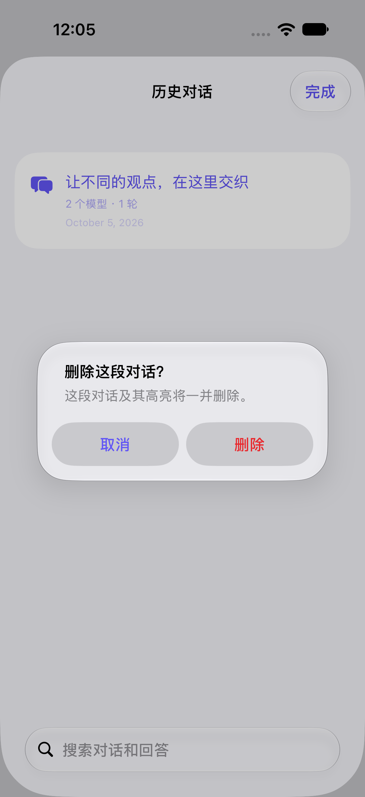


## 1.3.0 连续高亮与专注阅读

- 相邻高亮自动合并，空格与换行不打断连续区域；补选中间片段会连接两侧高亮。引用标签同步合并，点击合并区域中的任一句取消整块高亮。
- 向下阅读时顶部模型标签与底部输入框平滑移出，释放阅读空间；反向滚动恢复显示。iPhone 左右切换模型以及 iPad 横向滚动模型列时恢复上下栏。
- 自动生成和选区边缘自动滚动不触发阅读栏隐藏；系统“减弱动态效果”开启时改用淡入淡出。

验证：23 项单元测试、3 项 iPhone 界面测试及 2 项 iPad 界面测试全部通过，覆盖相邻合并、两侧连接、整块取消、独立引用保留、上下栏收起/恢复与模型切换。

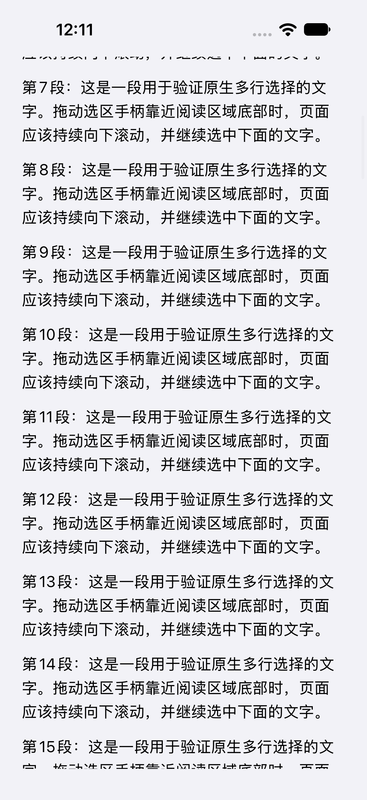


## 1.3.1 阅读边缘

专注阅读时，文字延伸至顶部状态栏背后与屏幕底部。顶部使用系统半透明毛玻璃，并在下缘渐变淡出；底部不再保留遮挡文字的空白安全区域。模型标签与输入框显示时继续使用正常安全区域。

验证：iPhone 与 iPad 阅读交互界面测试通过，覆盖上下边缘、反向滚动恢复及 iPhone 模型切换；已完成真机签名构建。

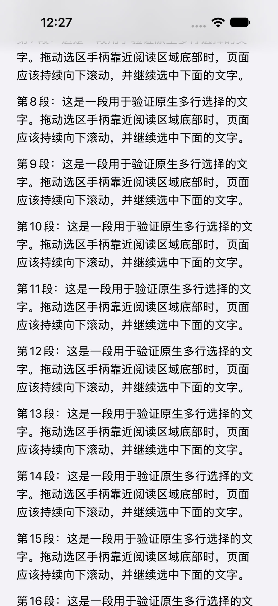


## 1.4.0 滚动轮次与引用历史

- 移除右上角轮次菜单。滚动时右侧浮现轮次横杠，当前轮次使用强调色；点击跳转，按住并拖动跨越横杠时立即切换，同时显示轮次标签与轻触反馈。停止后 3 秒淡出。
- 发送消息下方可以展开“高亮引用”，查看随该消息发送的文本、来源模型和轮次。引用以快照保存，后来取消高亮不会改动已发送消息。旧版本生成的引用提示也会恢复为可展开内容。
- 每个模型、每段对话分别保留本次使用中的阅读位置。左右切换模型时恢复原来的文字位置，切换历史对话时也保留独立位置；新增消息只让正在阅读的模型滚到最新内容。
- iPad 每列独立滚动和切换轮次。

验证：26 项单元测试、2 项 iPhone 界面测试和 2 项 iPad 界面测试通过，覆盖点击/拖动轮次跳转、消息引用展开、引用快照持久化、旧数据兼容以及模型往返位置恢复。真机签名构建通过。

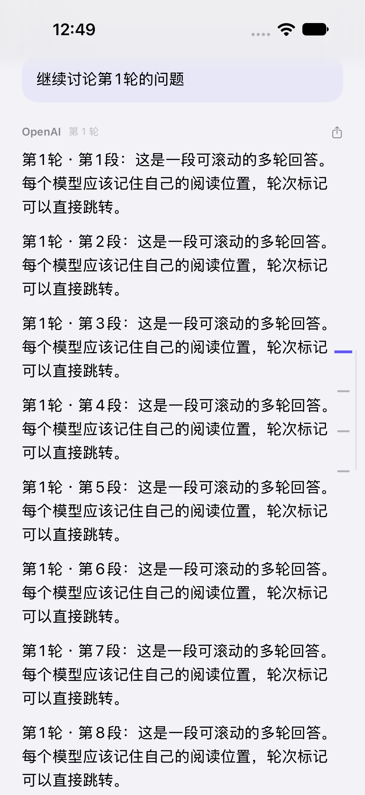
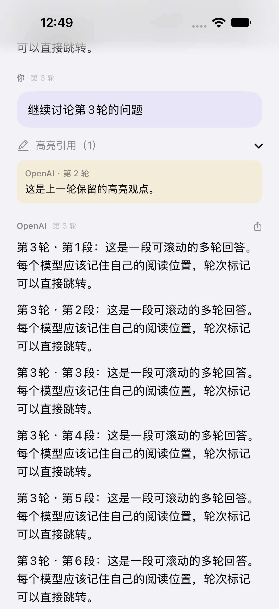


## 1.4.1 状态栏 Liquid Glass

专注阅读顶部改用系统原生 Liquid Glass，使用 regular 材质、轻微系统背景色调与适度透明度，保留状态栏信息对比度，让正文隐约透出。下缘继续渐变淡出。已检查浅色与深色显示，两个模式的阅读交互测试均通过；真机签名构建通过。

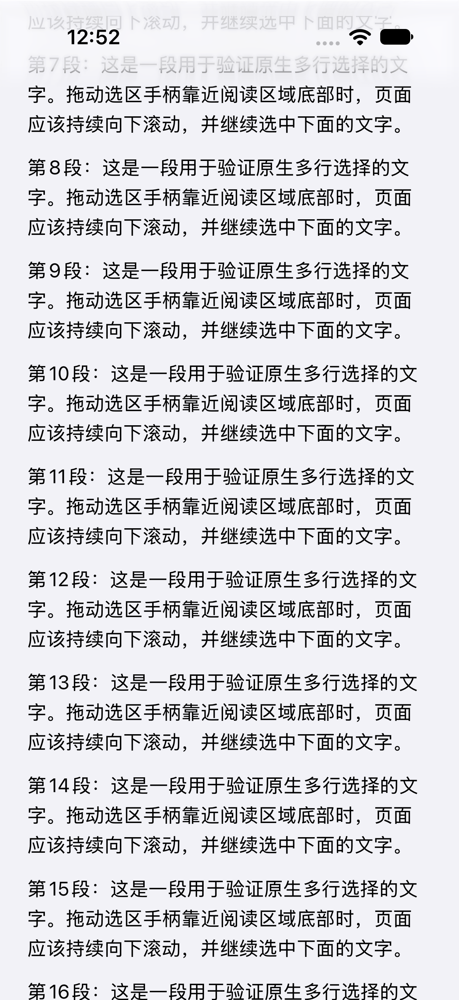
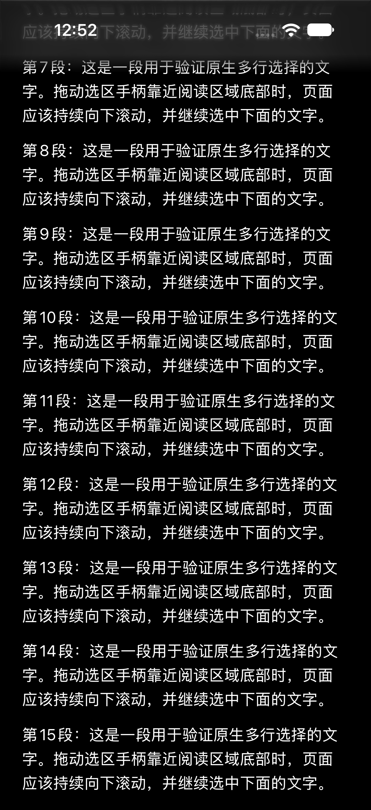


## 1.5.0 阅读交互与玻璃栏

- 点击轮次横杠、左右切换模型均提供轻触觉反馈；轮次拖动仍有逐轮反馈。
- 模型标签和输入框使用系统原生 Liquid Glass，降低选中标签色调浓度，保持文字清晰。
- 固定正文宽度，限制纵向阅读器与文本控件的横向偏移，模型切换和轮次跳转后保持居中。
- 轮次横杠不参与正文宽度计算；新增横向位置检查覆盖模型往返和轮次点击。
- 设置入口改为“参与共建”，说明为“共享源码，欢迎贡献想法与代码。”

验证：26 项单元测试、7 项 iPhone 界面检查和 3 项 iPad 界面检查通过，覆盖正文居中、轮次跳转、阅读位置恢复、输入框、SVG 与选择自动滚动。真机签名构建通过。触觉反馈需在真机体验。

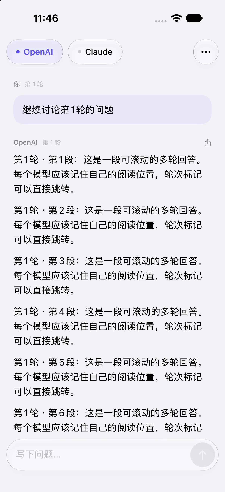


## 1.5.1 上下栏周边的透视效果

正文始终延伸到状态栏、模型标签和输入框后方。上下栏周围使用整片原生 Liquid Glass，边缘渐变淡出；正文的首尾通过动态内容边距避开控件，输入框换行和引用区展开时也会更新底部边距。

验证：6 项 iPhone 界面检查与 3 项 iPad 界面检查通过，覆盖玻璃栏后的完整阅读范围、模型位置恢复、轮次跳转、键盘输入、多行输入框、选择自动滚动和横竖屏并排阅读。已检查浅色和深色透视效果，真机签名构建通过。

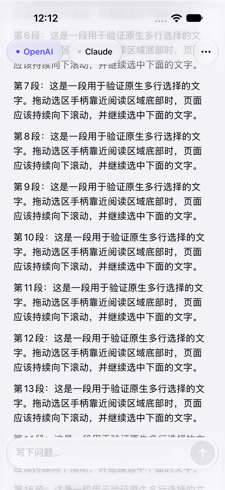
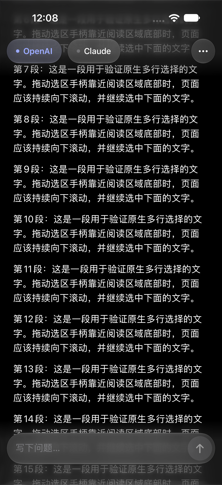


## 1.6.0 轮次阅读与备份

- 轮次横杠改为轻微圆角；点击和按住拖动切换均平滑滚动，保留轮次触觉反馈。
- 发送新一轮问题及回答返回后，定位到本轮用户消息开头；尚未显示的模型页面在切换时完成定位。
- 恢复系统纵向滚动条，并提供较宽的手指拖动区域。滚动条与轮次横杠分开操作，均可快速定位。
- 更多菜单改用 UIKit 原生菜单，显示前冻结正文滚动惯性，避免玻璃菜单文字受运动影响。
- 新增本地 / iCloud 文件备份与恢复。备份格式带版本号，检查模型接口、重复身份与高亮范围；导入前保留原文件，密钥写入失败会回滚，不替换现有记录。
- 修复恢复模型阅读位置时，顶部栏和正文内边距造成的偏移。

API Key 为可选备份内容，默认关闭。iCloud 由系统「文件」位置选择器提供，设备需已登录 iCloud 并启用云盘；这里不增加自动云同步。

验证：30 项单元测试通过，包含备份往返、持久化恢复、密钥选择、无效文件拒绝及导入前原文件保留。iPhone 的 8 项相关界面检查与 iPad 的 4 项相关界面检查覆盖文件导出、轮次切换、滚动条拖动、新轮次定位、菜单、阅读位置恢复和选区滚动。界面检查使用演示数据，未调用真实模型；真机签名构建通过。

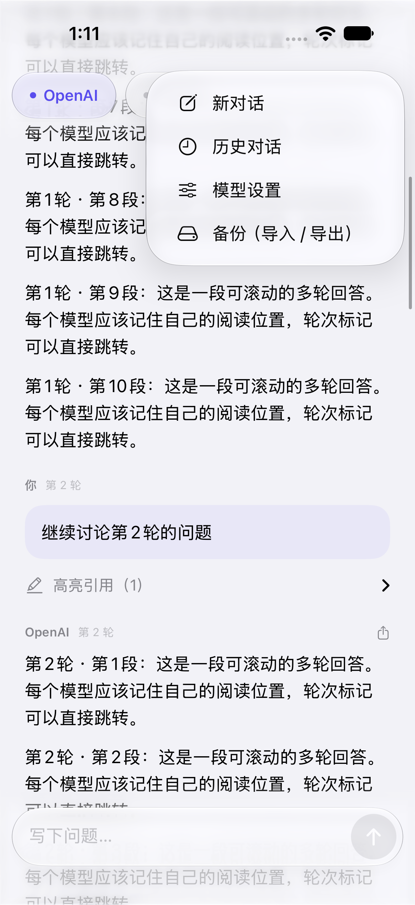
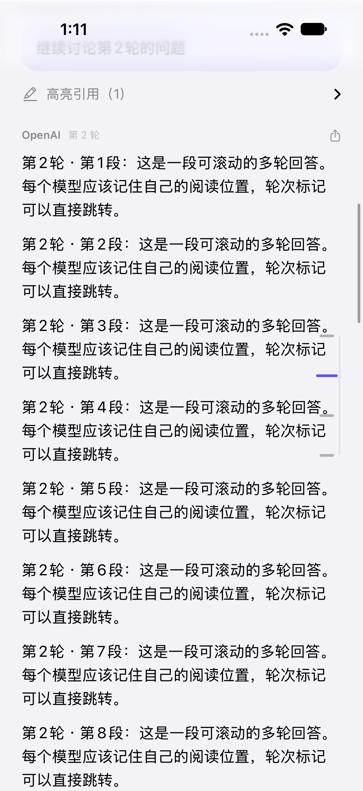

### 1.7.0：备份分类与轮次标记

“更多”菜单统一使用“备份”。备份页面分为“导出到文件”（系统文件导入/导出）和“iCloud 原生备份”（CloudKit 私有数据库，直接备份/恢复）。云端使用一个可更新的最新归档，恢复前仍需确认；API Key 默认不包含。轮次横杠移近系统滚动条，删除装饰竖线，保留原生滚动条拖动和横杠点击/拖动。

原生 iCloud 需要开发者账户开通容器 `iCloud.online.minidesk.loom`、CloudKit 服务和匹配描述文件。当前已安装版本的签名不包含该权限，因此界面明确提示暂不可用，不会把文件导出当成直接云备份。`Configuration/iCloud.entitlements` 提供权限配置；获得匹配签名后，构建时同时设置 `CODE_SIGN_ENTITLEMENTS=Configuration/iCloud.entitlements` 和 `SWIFT_ACTIVE_COMPILATION_CONDITIONS='DEBUG LOOM_ICLOUD'`（Release 使用 `LOOM_ICLOUD`），并在 CloudKit Console 将 `LoomBackup` 类型的 `archive`（Asset）和 `createdAt`（Date/Time）部署至生产环境后再发布正式版。首次开发环境保存可创建 schema；生产环境不能自动创建。

已验证普通版本及启用 `LOOM_ICLOUD` 的模拟器版本编译。真实云端往返验证需在获得 iCloud 签名、登录测试 iCloud 账户后进行。

本轮验证：30 项单元测试、3 项 iPhone 界面测试、4 项 iPad 界面测试通过。包括文件导出、无 iCloud 权限时的明确提示、轮次横杠点击/拖动以及系统滚动条拖动。1.7.0（14）已安装并启动于 iPhone 15 Pro。
